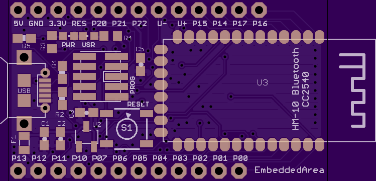
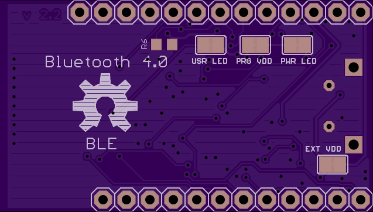

HM-10 Breakout Board
====================

The HM-10 breakout board provides breadboard-pitch access to the HM-10 BLE module. 
The HM-10's on board TI CC2540 is fully programmable with CC-Debugger or SmartRF04EB.

##Bill of Materials

If you are planning on ordering the PCB through OSHPark, you should note that you will receive three copies of the board. You may want to go ahead and order three of each component you intend to use. Digi-Key numbers are provided as a courtesy; check ebay or any other preferred supplier for better pricing. As long as the component matches the packaging a specifications, it should be fine.

At a bare minimum, the PCB, HM-10 module, reset switch and one 1kΩ resistor are required. Indicator LEDs are optional, as are the accompanying 470Ω resistors. Additionally, the CC debugger header and and USB connector are optional; if you elect to leave this off you may also leave off the two 33Ω resistors, one of the 1kΩ resistors, and the 1.5kΩ resistor. The 3.3v regulator is only available to be populated if you want to use the USB connector (which is at 5v). Using it in other situations defeats the purpose of using a low power communications technology. If you are leaving off the regulator, you may also leave off the .47uF and 2.2uF capacitors.

Part (Digi-Key #) | Quantity | Optional (Required For)
:---------------- | :-------:| :----------------------
[Breakout PCB](https://oshpark.com/shared_projects/mgt9vH1j)  | 1 | No
[HM-10 Module](http://www.fasttech.com/products/0/10004051/1292002-ti-cc2540-bluetooth-40-ble-2540-transparent-serial) | 1 | No
[0603 1uF Capacitor](http://www.digikey.com/product-detail/en/CC0603ZRY5V7BB105/311-1372-1-ND/2103156) (311-1372-1-ND) | 1 | No
[Tactile Switch](http://www.digikey.com/product-detail/en/PTS645SH50SMTR92%20LFS/CKN9085CT-ND/1146817) (CKN9085CT-ND) | 1 | No
[CC Debugger Header](http://www.digikey.com/product-detail/en/20021121-00010C4LF/609-3695-1-ND/2209147) (609-3695-1-ND)  | 1 | Yes (CC Debug capability)
[0603 LED](http://www.digikey.com/product-detail/en/LTST-C191KRKT/160-1447-1-ND/386836) (160-1447-1-ND) | 1 | Yes (LEDs)
[0603 LED (>3v drop)](http://www.digikey.com/product-detail/en/APT1608QBC%2FD/754-1434-1-ND/2163792) (754-1434-1-ND) | 2 | Yes (LEDs)
[0603 470Ω Resistor](http://www.digikey.com/product-detail/en/RC0603JR-07470RL/311-470GRCT-ND/729738) (311-470GRCT-ND)| 2 | Yes (LEDs)
[Micro USB Connector](http://www.digikey.com/product-detail/en/0475890001/WM17143TR-ND/1832253) (WM17143TR-ND) | 1 | Yes (USB)
[0603 33Ω Resistor](http://www.digikey.com/product-detail/en/RC0603JR-0733RL/311-33GRCT-ND/729718) (311-33GRCT-ND) | 2 | Yes (USB)
[0603 1.5kΩ Resistor](http://www.digikey.com/product-detail/en/RMCF0603FT1K50/RMCF0603FT1K50CT-ND/1943003) (RMCF0603FT1K50CT-ND) | 1 | Yes (USB)
[0603 1kΩ Resistor](http://www.digikey.com/product-detail/en/RC0603JR-071KL/311-1.0KGRCT-ND/729624) (311-1.0KGRCT-ND) | 2 | One (USB)
[SOT-23 MCP1700 Voltage Regulator](http://www.digikey.com/product-detail/en/MCP1700T-3302E%2FTT/MCP1700T3302ETTCT-ND/652677) (MCP1700T3302ETTCT-ND) | 1 | Yes (USB; 5v external power)
[0603 .47uF Capacitor](http://www.digikey.com/product-detail/en/C0603C474J4RACTU/399-7339-1-ND/3316954) (399-7339-1-ND) | 1 | Yes (3.3v regulator)
[0603 2.2uF Capacitor](http://www.digikey.com/product-detail/en/GRM188R61A225KE34D/490-1545-1-ND/587767) (490-1545-1-ND) | 2 | Yes (3.3v regulator) 

##Links

Assembly: http://www.instructables.com/id/How-to-Create-an-Arduino-Compatible-Bluetooth-40-M/

On-going HM-10 research: http://letsmakerobots.com/node/38009

Info about the HM-10 module: http://www.jnhuamao.cn/

HM-10 Datasheet:  http://www.jnhuamao.cn/bluetooth40_en.rar

Info about the famous CC2540: http://www.ti.com/product/cc2540&DCMP=LowPowerRFICs+Other&HQS=Other+OT+cc2540